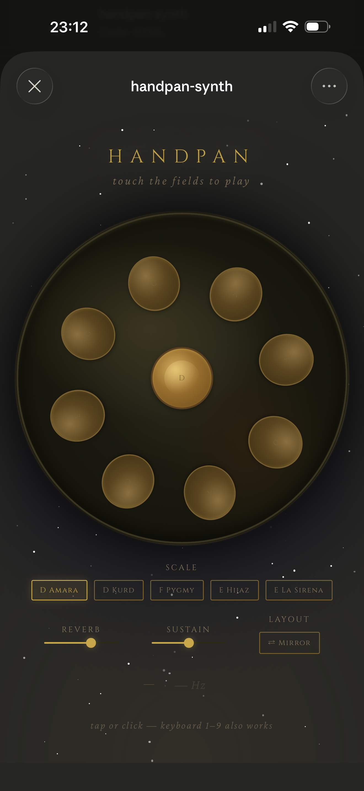
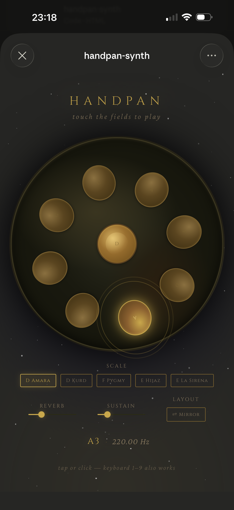

# simple-handpan
Synthesized handpan coded with free Claude chat.

## Notes
- Claude chat was immediately able to make a nice looking handpan app that was fairly functional and sounded nice, but it needed a lot of direction with handpan-specific info like the layout and scale info; Claude also ran into some silly bugs as it iterated
- There are still some minor issues, such as how the Mirror button works, and how it looks absolutely terrible in Safari and does not have the dark background as expected in Chrome

## References
- [Isthmus Instruments: What is a Handpan Scale? + 11 Popular Handpan Scales List](https://www.isthmusinstruments.com/isthmus-handpan-blog/what-is-a-handpan-scale?srsltid=AfmBOorj9ksmCC5kTzWuiVU_eRl9Z6BqDqAMalr3bwnz2SEiz2Q0Ejd_#11-popular-handpan-scales-list)
    - D Amara: D/ A C D E F G A C
    - D Kurd: D/ A Bb C D E F G A
    - F Pygmy: F/ G Ab C Eb F G Ab C
    - E Hijaz: E/A B C D# E F# G B
    - E La Sirena: E/ G B C# D E F# G B

## Screenshots

<table>
  <tr>
    <td></td>
    <td></td>
  </tr>
</table>